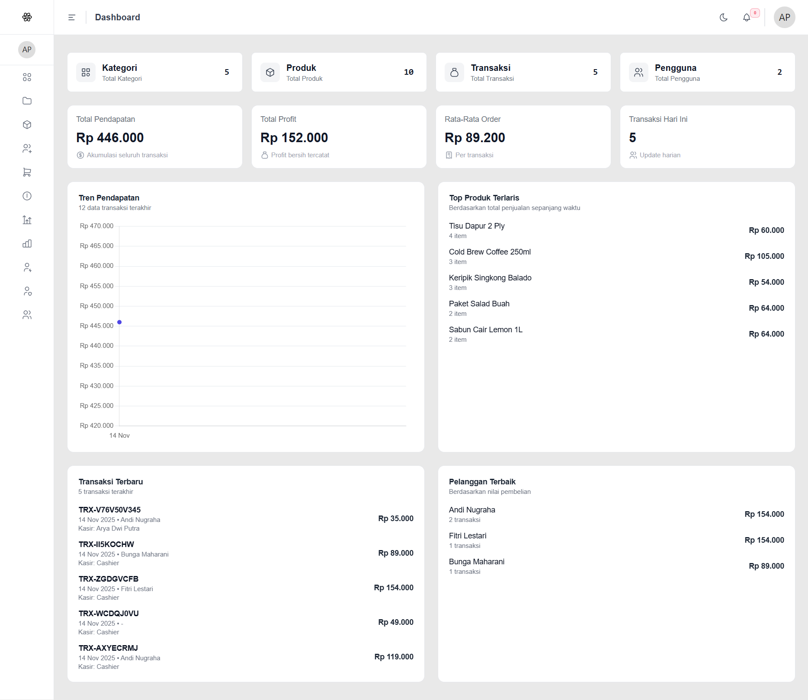
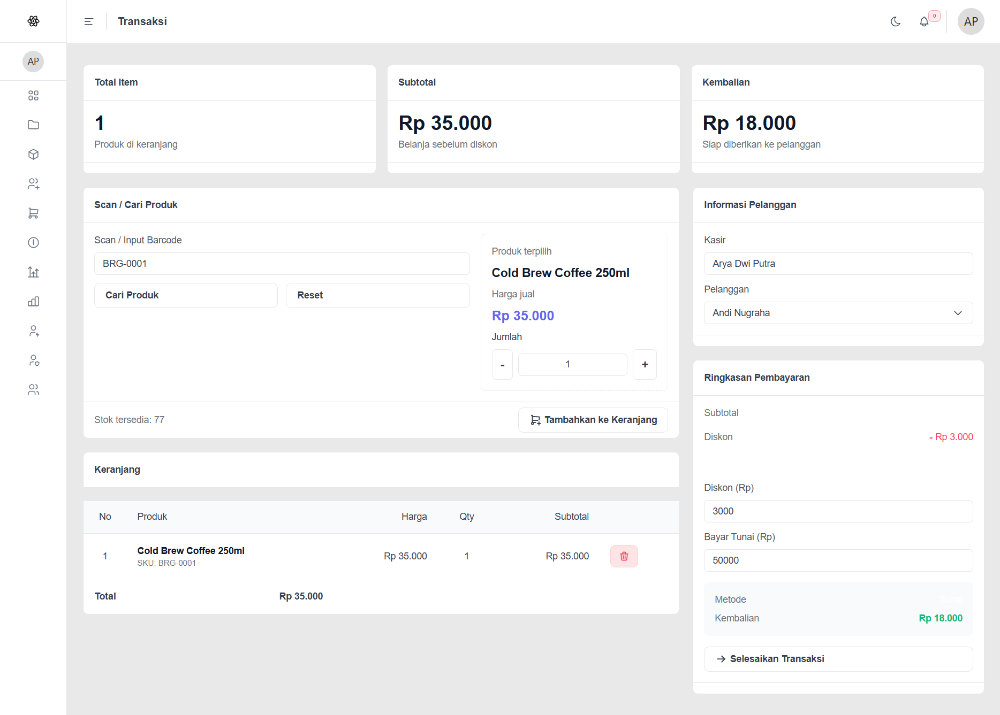
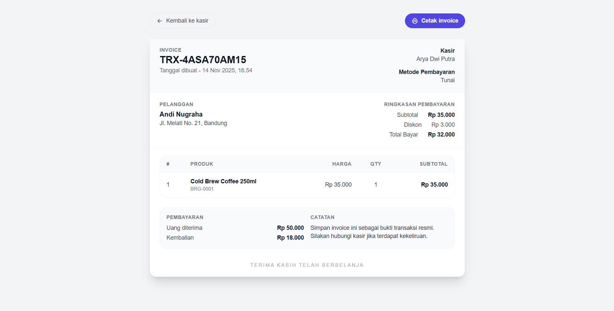

# Point of Sales – Laravel & Inertia

> Sistem kasir modern dengan alur transaksi cepat, dukungan laporan, dan mode cetak invoice yang rapi. Kalau kamu suka proyek ini, bantu dengan menekan ⭐ di atas – itu sangat membantu visibilitas repositori ini.


<sub>_Cuplikan antarmuka kasir. Screenshot tambahan ada di bagian di bawah._</sub>

## ✨ Kenapa Menarik?

-   **Kasir cepat & intuitif** – pencarian barcode, keranjang, ringkasan pembayaran, dan kalkulasi diskon otomatis.
-   **Invoice siap cetak & payment link** – setelah transaksi, kasir bisa melihat preview invoice elegan, membagikan link pembayaran Midtrans/Xendit, dan memilih kapan mau mencetaknya.
-   **Laporan lengkap** – dari penjualan, profit, sampai riwayat transaksi dengan filter multi parameter.
-   **Akses berbasis role** – integrasi Spatie Permissions bawaan untuk role, user, dan hak akses yang granular.
-   **Dark mode ready** – UI sudah disiapkan untuk mode gelap/terang tanpa konfigurasi tambahan.

## 🔧 Teknologi Inti

-   [Laravel 12](https://laravel.com) + [Inertia.js](https://inertiajs.com)
-   [React](https://react.dev) + [Tailwind CSS](https://tailwindcss.com)
-   [Spatie Laravel Permission](https://spatie.be/docs/laravel-permission)
-   [Tabler Icons](https://tabler-icons.io) untuk ikon kasir modern
-   Integrasi payment gateway Midtrans Snap & Xendit Invoice (opsional)

## 🚀 Cara Menjalankan

```bash
git clone https://github.com/<username>/point-of-sales.git
cd point-of-sales
cp .env.example .env
composer install && npm install
php artisan key:generate
php artisan migrate --seed
npm run dev
php artisan serve
```

> **Tip:** Jalankan `php artisan test` – tersedia feature test baru untuk memastikan alur transaksi & invoice tetap aman.

## 📊 Fitur Utama

-   **Dashboard**: ringkasan kategori, produk, transaksi, pendapatan, dan trend chart.
-   **Kelola Produk & Stok**: CRUD lengkap dengan kategori dan barcode unik.
-   **Modul Kasir**: pencarian barcode, keranjang multi item, diskon, hitung kembalian otomatis, dan pilihan gateway (tunai, Midtrans, Xendit).
-   **Invoice / Payment Link**: tampilan siap cetak + tombol manual print dan tautan pembayaran yang bisa dibagikan ke pelanggan.
-   **Riwayat Transaksi**: filter per tanggal/invoice/kasir + export laporan.
-   **Laporan Profit & Penjualan**: pantau performa bisnis dalam sekali klik.

## 📷 Cuplikan Layar

| Modul                  | Preview                                                    |
| ---------------------- | ---------------------------------------------------------- |
| Dashboard              |  |
| Kasir / POS            |              |
| Invoice Ready-to-Print |      |

<sub>_Tidak ada file? Silakan ganti dengan screenshot kamu sendiri di `public/media`. Table akan otomatis menarik namanya._</sub>

## 🧪 Pengujian

```bash
php artisan test --filter=TransactionFlowTest
```

Pengujian ini mensimulasikan checkout lengkap: keranjang ➜ transaksi ➜ invoice, termasuk validasi stok, detail transaksi, profit, hitung stok, integrasi Midtrans (HTTP fake), dan render Inertia untuk halaman print.

## 🤝 Kontribusi

1. Fork repo ini
2. Buat branch fitur: `git checkout -b feature/namamu`
3. Commit perubahanmu: `git commit -m "Tambah fitur X"`
4. Push branch: `git push origin feature/namamu`
5. Buka Pull Request

Ada bug atau ide fitur? Buat issue supaya kita bisa diskusi bareng.

## Authors

-   [Arya Dwi Putra](https://www.github.com/aryadwiputra)
-   Aplikasi ini menggunakan resource dari https://github.com/Raf-Taufiqurrahman/RILT-Starter dengan beberapa modifikasi yang saya lakukan terhadap komponen-komponen untuk mendukung aplikasi kasir

## ⭐ Dukung Proyek Ini

Kalau repositori ini membantumu membangun POS lebih cepat, klik **Star**. Dukungan kecil ini bikin proyek tetap aktif dan membantu developer lain menemukannya. Terima kasih! 🙌

---

Made with ❤️ menggunakan Laravel + React oleh komunitas Point of Sales.
