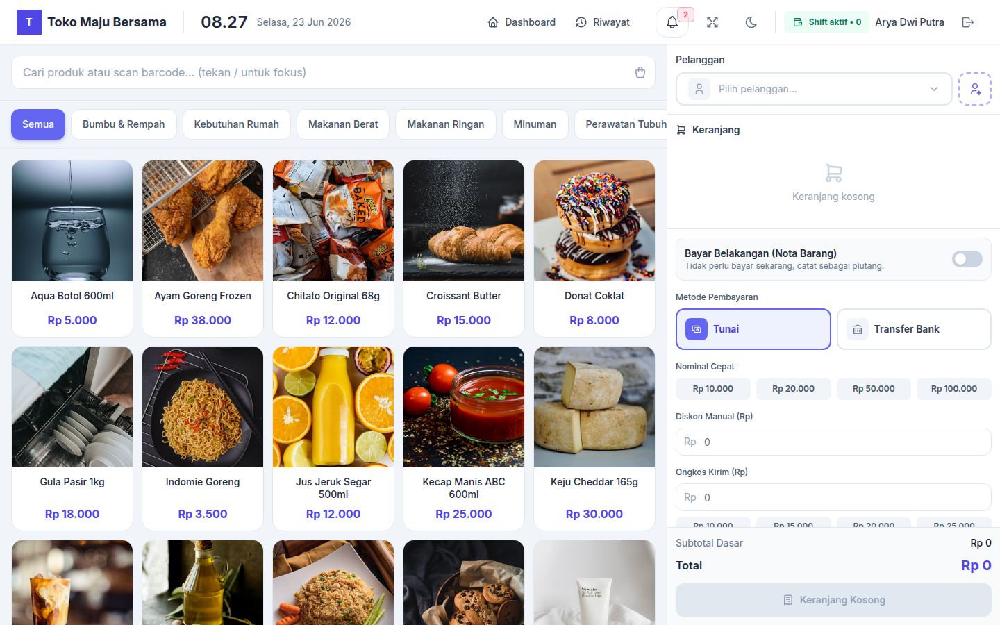
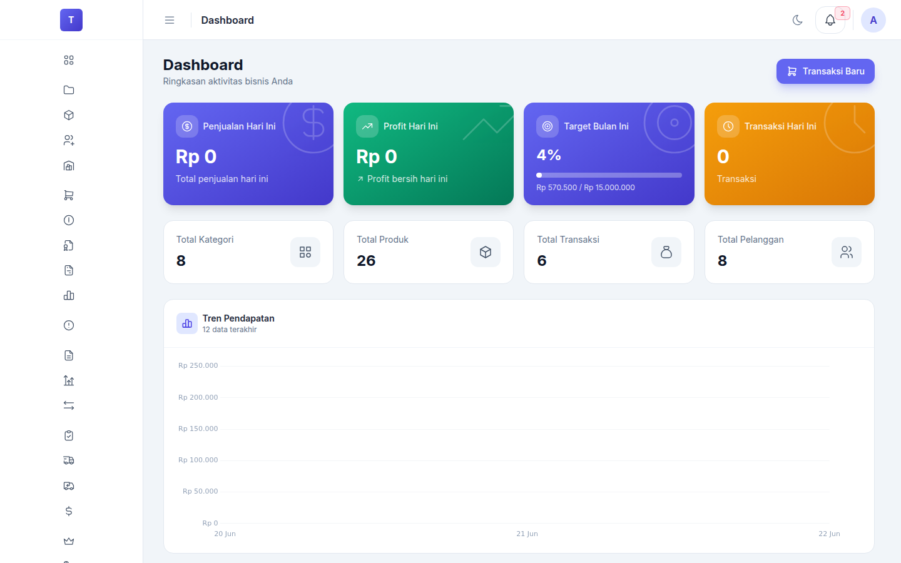
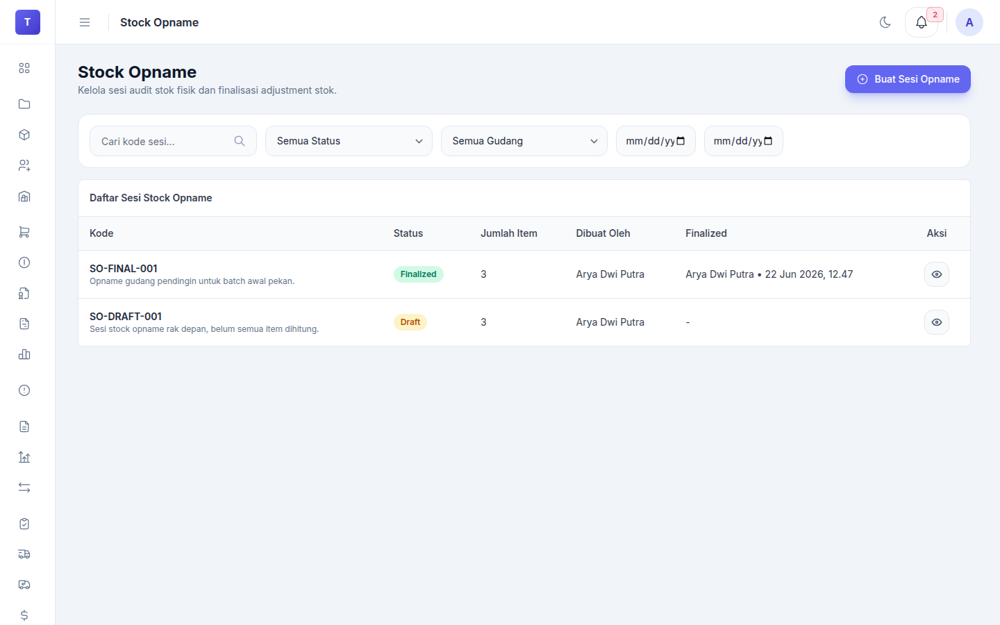
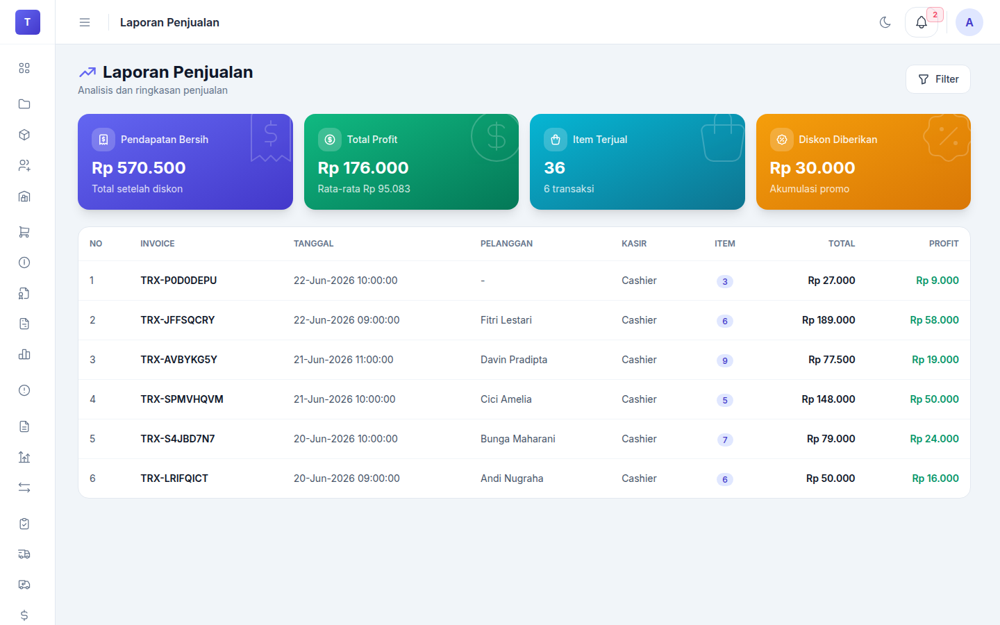
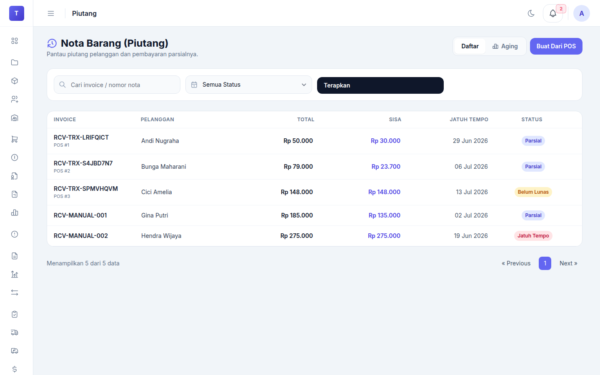
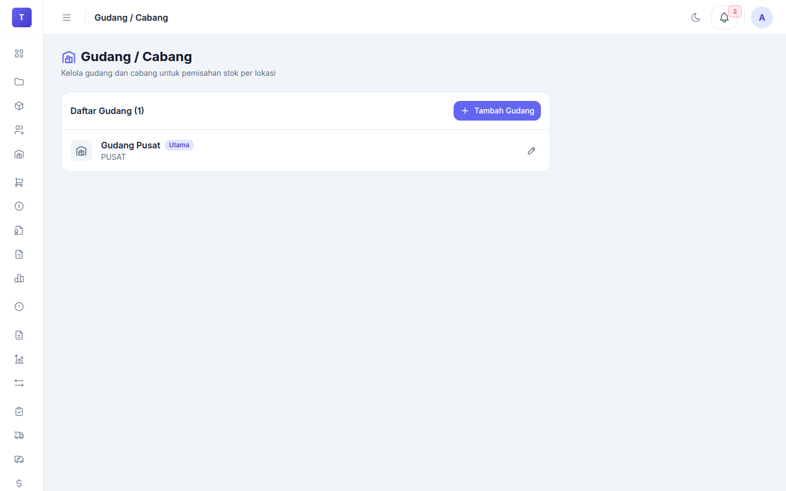

# Point of Sales

Sistem kasir berbasis Laravel + Inertia + React untuk transaksi penjualan, inventory audit, purchasing, finance, CRM, loyalty, dan observability operasional — dengan dukungan multi-warehouse, PPN, dan offline mode.

> 200+ GitHub stars • Open-source • MIT License

---

## Cuplikan Layar

| POS Checkout | Dashboard | Stock Opname |
|:---:|:---:|:---:|
|  |  |  |
| **Sales Report** | **Receivables** | **Multi-Warehouse** |
|  |  |  |

📸 **[Lihat galeri lengkap (33 screenshot)](docs/screenshots.md)**

---

## Fitur Utama

### POS & Transaksi
- Pencarian produk via barcode / keyword
- Barcode scanner via kamera (PWA)
- Cart multi-item dengan hold/resume
- Checkout multi-metode: tunai, transfer bank, Midtrans, Xendit, pay later
- Multi-satuan produk (pcs, box, kg, karton) dengan konversi stok otomatis
- Multi-price list: harga berbeda per kelompok pelanggan
- Promo engine: diskon, qty break, bundle, buy-x-get-y
- Diskon dengan approval workflow
- PPN 11% (exclusive/inclusive)
- Thermal printer support (WebUSB)
- Offline mode (queue transaksi saat offline, sync saat online)

### Inventory & Multi-Warehouse
- Manajemen produk + kategori + barcode
- Stok terpisah per gudang/cabang
- Transfer stok antar warehouse (draft → send → receive)
- Stock opname per warehouse
- Stock mutation history
- Batch/expiry date tracking (FEFO)
- Composite products / kits
- Reorder point + auto-PO suggestion
- Low stock notification

### Purchasing
- Purchase Order (draft → ordered → partial → completed)
- Goods Receiving (dengan input batch)
- Supplier Returns
- Payables (hutang supplier) dengan aging

### Finance
- Receivables (piutang pelanggan) dengan partial payment
- Aging analysis + collection notes
- PPN/PPh tax management
- Customer portal: lihat invoice + bayar piutang online

### CRM & Loyalty
- Customer management + wilayah Indonesia
- Member tiers (regular, silver, gold, platinum)
- Poin loyalty (earn/redeem)
- Voucher customer
- Customer segments (manual & auto)
- Campaign automation (reminder, promo broadcast)
- **WhatsApp Gateway** — kirim pesan otomatis via whatsapp-web.js (QR scan, session persistent)

### Reports & Documents
- Sales report + filter + summary
- Profit report + margin analysis
- Advanced sales insights (hourly, cashier performance, repeat customer)
- PDF invoice, receipt (80mm/58mm), shipping label
- PDF receivable/payable
- Export ke Excel (produk, customer, transaksi)

### Admin
- Full RBAC (users, roles, permissions)
- Audit log (before/after snapshot)
- Import produk & customer dari Excel
- **App Versioning** — versi aplikasi terpusat (`APP_VERSION`), tampil di sidebar + POS navbar

### Integrasi
- **WhatsApp Gateway** — terhubung via Node.js service (`whatsapp-service/`)
- **Payment Gateways** — Midtrans, Xendit

---

## Quick Start

```bash
git clone https://github.com/aryadwiputra/point-of-sales.git
cd point-of-sales
cp .env.example .env
composer install && npm install
php artisan key:generate
php artisan migrate --seed
php artisan storage:link

# Dev servers — jalankan semua di terminal terpisah
npm run dev          # Vite HMR
php artisan serve    # Laravel

# WhatsApp Gateway (opsional) — untuk kirim WA otomatis
cd whatsapp-service
npm install && npm start
```

## Default Login

- Admin: `arya@gmail.com` / `password`
- Kasir: `cashier@gmail.com` / `password`

## Dokumentasi Detail

| Dokumen | Isi |
|---------|-----|
| `docs/getting-started.md` | Setup lengkap |
| `docs/configuration.md` | Konfigurasi environment, payment, pajak, printer, WhatsApp |
| `docs/architecture-overview.md` | Arsitektur, middleware, service layer, Node service |
| `docs/feature-index.md` | Indeks semua modul (44 fitur) |

### Per Modul

- POS & Transaksi, Sales Return, Cashier Shift
- Inventory: produk, stock opname, mutation, warehouse, stock transfer, batch, composite
- Purchasing: PO, goods receiving, supplier return, payables
- Finance: receivables, PPN
- Pricing: pricing rules, price list, loyalty, vouchers
- CRM: member, segments, campaigns, **WhatsApp Gateway**
- Reports: sales, profit, insights, dokumen PDF
- Tools: import/export, mobile POS, thermal printer, offline mode

## Troubleshooting Umum

1. **Permission cache stale setelah seeding** — logout lalu login lagi
2. **Webhook Midtrans/Xendit tidak bekerja** — pastikan `APP_URL` public, bukan `localhost`
3. **Gambar produk tidak tampil** — jalankan `php artisan storage:link`
4. **Route error 500** — jalankan `php artisan migrate` untuk modul baru
5. **Test gagal karena PPN** — pastikan `tax_rate=0` di test Product::create
6. **Vite tidak jalan** — pastikan `npm run dev` berjalan, jangan hanya `php artisan serve`
7. **WhatsApp QR tidak muncul** — pastikan `whatsapp-service/` sudah jalan (`npm start`)
8. **WhatsApp terputus** — klik "Hubungkan Ulang" di Settings > WhatsApp, scan ulang QR

## Kontribusi

1. Branch dari `development`: `git checkout -b feature/nama-fitur development`
2. Buat PR ke `development`
3. PR ke `main` hanya dari `development` via branching release

Pastikan `php artisan test` lulus sebelum PR.

## Lisensi

MIT License
